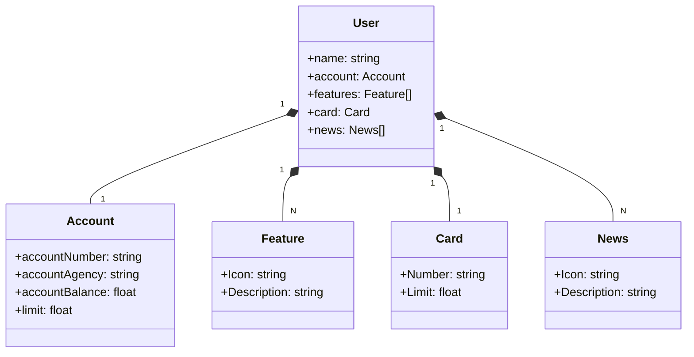

# Bootcamp Avanade 2025 
Java RESTful API criada em conjunto com a Avanade 2025 na DIO.

## Diagrama de classes:

```mermaid 
classDiagram
    class User {
        +name: string
        +account: Account
        +features: Feature[]
        +card: Card
        +news: News[]
    }

    class Account {
        +accountNumber: string
        +accountAgency: string
        +accountBalance: float
        +limit: float
    }

    class Feature {
        +Icon: string
        +Description: string
    }

    class Card {
        +Number: string
        +Limit: float
    }

    class News {
        +Icon: string
        +Description: string
    }

    User "1" *-- "1" Account
    User "1" *-- "N" Feature
    User "1" *-- "1" Card
    User "1" *-- "N" News
```
